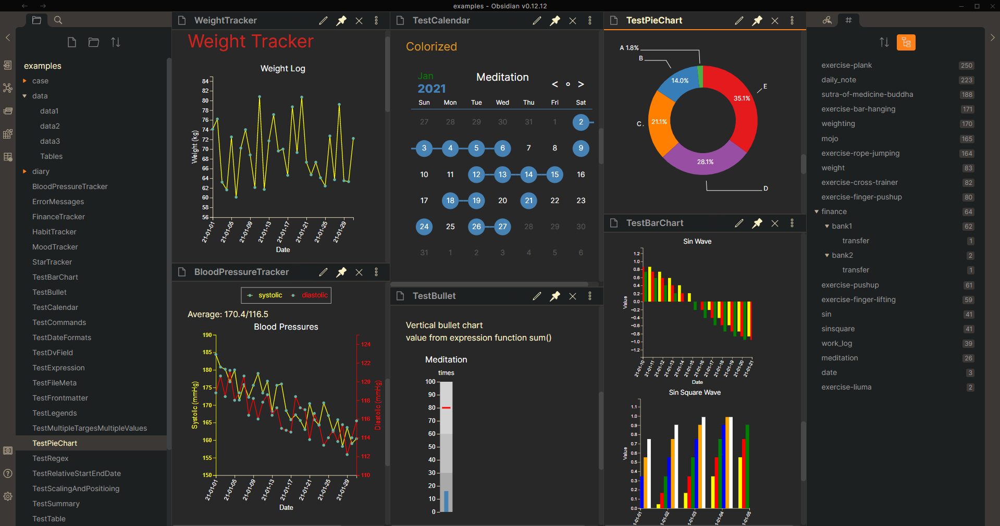

# Obsidian TrackerGT Plugin

This is an [Obsidian](https://obsidian.md/) plugin that helps you track and visualize data from notes. It is a continuation of the [Tracker](https://github.com/pyrochlore/obsidian-tracker) plugin from [@pyrochlore](https://github.com/pyrochlore), which had not seen any updates since August, 2021. Releases here start at 1.0.11. If you are looking for a prior release, you can find it in the original repo.

[Here](./docs/Examples.md) is a table containing simplified examples showing what you can track.

Contributions are welcome. I will do my best to respond within one day to any feature requests, comments, or pull requests. I do not want total ownership over this plugin--I just want to keep it alive!

## What's New

Version 1.11.0

- Support for inline dataview fields. Thanks, @Laharah
- Adds ability to track boolean properties. Thanks, @bnjbvr

Version 1.10.0

- Add annotation mode for month view ([examples](./examples/TestCalendar.md))
- Add parameters `xAxisTickInterval`, `yAxisTickInterval`, `xAxisTickLabelFormat` and `yAxisTickLabelFormat` for the line and bar chart ([examples](./examples/TestAxisIntervalAndFormat.md))
- Allow using regular expression in parameter `dateFormatPrefix` and `dateFormatSuffix` ([examples](./examples/TestDateFormats.md))
- Add parameters `file`, `specifiedFilesOnly`, `fileContainsLinkedFiles`, and `fileMultiplierAfterLink` to retrieve data from specified files ([examples](./examples/TestSpecifiedFiles.md))
- Add a parameter `textValueMap` to convert texts or emojis to specified values ([examples](./examples/TestTextValueMap.md))
- Fixed bugs
- Enhanced error messages

Version 1.10.1

- Fixed 'failed to load plugin' on iOS

Version 1.10.2

- Fixed plugin not rendering on some macOS machines

Version 1.10.3

- Allow using the parameter `fitPanelWidth` with the output type `month` and `pie`
- Fixed the resizing and positioning of the chart tooltip

Version 1.10.4

- Allow using a regular expression as a key of the parameter `textValueMap`
- Add a parameter `shiftOnlyValueLargerThan` to determine when to do `valueShift`
- Fixed bugs reported by users
- Fixed typo in plugin settings

Version 1.10.5

- Allow using a relative date value in `initMonth` in the month view

Version 1.10.6

- Fixed the coloring for missing data in the month view

Version 1.10.7

- Allow using html image tags as emoji inputs

Version 1.10.8

- Fixed startDat/endDate misread as a relative date

Version 1.10.9

- Replace tab characters by spaces
- Accept more unicode characters in dvField
- Allow emojis in the folder path
- Fixed bugs

## !!! Breaking Changes !!!

From version 1.9.0, template variables, e.g. '{{sum}}', are deprecated. Instead, Tracker provide operators (+, -, \*, /, %) and functions (dataset(), sum(), maxStreak(), ......etc) to help us do data processing. For users having code blocks from previous version, please replace '{{sum}}' by '{{sum()}}' or '{{sum(1)}}' by '{{sum(dataset(1))}}'. More information about the new expressions could be found [here](./docs/Expressions.md).

## Usage

1. Have some targets you want to track in daily notes.
2. Add a new note for displaying the tracker.
3. Add tracker code blocks manually ([examples](https://github.com/greater-than/TrackerGT-obsidian/tree/main/examples)) or using [commands](./docs/Commands.md).
4. Switch the document view mode to 'Preview', then the code block will get rendered.

For more use cases, please download and open the [examples](https://github.com/greater-than/TrackerGT-obsidian/tree/main/examples) folder in obsidian with this plugin installed and enabled.

## More Details You May Want to Know

- [Installation](./docs/Installation.md): Install the plugin from Obsidian or install it manually
- [Concepts](./docs/Concepts.md): Explain how this plugin works and what to setup
  - [Target Evaluation](./docs/TargetEvaluation.md)
  - [Input Parameters](./docs/InputParameters.md)
  - [Expressions](./docs/Expressions.md)
- [Examples](./docs/Examples.md)
- [Plugin Settings](./docs/Settings.md)
- [Release Notes](./docs/ReleaseNotes.md)
- [Road Map](./docs/RoadMap.md)
- [Frequently Asked Questions](./docs/Questions.md)

## Support

- If you like this plugin or want to support further development, you can [Buy Me a Coffee](https://www.buymeacoffee.com/greater-than).
- Please report bugs and request features in [GitHub Issues](https://github.com/greater-than/TrackerGT-obsidian/issues)
